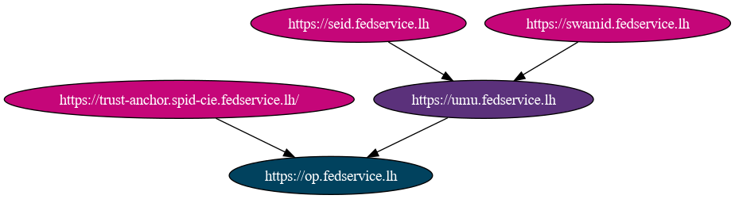
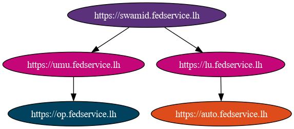

# ofcli

[](https://badge.fury.io/py/ofcli)
[](https://pypi.python.org/pypi/ofcli)
[](https://pypi.python.org/pypi/ofcli)
[](https://github.com/dianagudu/ofcli/-/pipelines)
[](https://github.com/dianagudu/ofcli/-/pipelines)


This is a helper CLI tool for exploring OIDC federations.

## Installation

ofcli works with Python 3.7+.

The recommended way to install `ofcli` is with `pip`:

```bash
pip install ofcli
```

If the setup process exits with the following error messages:

````
      pygraphviz/graphviz_wrap.c:3020:10: fatal error: graphviz/cgraph.h: File o directory non esistente
       3020 | #include "graphviz/cgraph.h"
            |          ^~~~~~~~~~~~~~~~~~~
      compilation terminated.
      error: command '/usr/bin/x86_64-linux-gnu-gcc' failed with exit code 1
      [end of output]
  
  note: This error originates from a subprocess, and is likely not a problem with pip.
  ERROR: Failed building wheel for pygraphviz

````

Please install the graphviz development files, such as for debian/ubuntu using the following command:

````
sudo apt install libgraphviz-dev
````


This will ensure that the stable version is fetched from pip, rather than the development version.

## Usage

```bash
Usage: ofcli [OPTIONS] COMMAND [ARGS]...

  Tool for exploring an OIDC federation.

Options:
  --insecure         Disable TLS certificate verification.
  --log-level LEVEL  Either CRITICAL, ERROR, WARNING, INFO or DEBUG. Default
                     value: ERROR.  [env var: LOG]
  --debug            Sets the log level to DEBUG.
  --version          Print program version and exit.
  --help             Show this message and exit.

Commands:
  discovery    Discover all OPs in the federation available to a given RP. If
               no trust anchor is specified, all possible trust anchors will
               be used.
  entity       Commands for working with an entity in an OIDC federation.
  fetch        Fetch an entity statement
  list         List all subordinate entities.
  resolve      Resolve metadata and Trust Marks for an entity, given a trust
               anchor and entity type.
  subtree      Discover federation subtree using given entity as root.
  trustchains  Builds all trustchains for a given entity and prints them.
```

For each subcommand, you can use the `--help` flag to get more information about the subcommand.

```bash
$ ofcli trustchains --help
Usage: ofcli trustchains [OPTIONS] ENTITY_ID

  Builds all trustchains for a given entity and prints them. If any trust
  anchor is specified, only trustchains ending in the trust anchor will be
  shown.

Options:
  --ta, --trust-anchor TA_ID  Trust anchor ID to use for building trustchains
                              (multiple TAs possible).
  --export DOT_FILE           Export trustchains to a dot file.
  --details                   Prints trustchains with additional details,
                              including entity statements and expiration
                              dates.
  --insecure                  Disable TLS certificate verification.
  --log-level LEVEL           Either CRITICAL, ERROR, WARNING, INFO or DEBUG.
                              Default value: ERROR.  [env var: LOG]
  --debug                     Sets the log level to DEBUG.
  --version                   Print program version and exit.
  --help                      Show this message and exit.
```

### Examples

Following, various example outputs.

1. Trustchains

```bash
$ ofcli trustchains https://op.fedservice.lh --export op-chains
* https://op.fedservice.lh -> https://trust-anchor.spid-cie.fedservice.lh/
* https://op.fedservice.lh -> https://umu.fedservice.lh -> https://swamid.fedservice.lh
* https://op.fedservice.lh -> https://umu.fedservice.lh -> https://seid.fedservice.lh
```

This will export the trust tree for the entity `https://op.fedservice.lh` to the file [examples/op-chains.dot](examples/op-chains.dot) in the [DOT language](https://en.wikipedia.org/wiki/DOT_(graph_description_language)).

The file can be converted to an image using the `dot` command from the [Graphviz](https://graphviz.org/) package (or any other tool that can read DOT files):

```bash
dot -Tpng examples/op-chains.dot -o examples/op-chains.png
```




2. Federation discovery

Discovering all entities in a sub-federation given by its root entity:

```bash
$ ofcli subtree https://swamid.fedservice.lh --export swamid-fed
- https://swamid.fedservice.lh (federation_entity)
  - https://umu.fedservice.lh (federation_entity)
    - https://op.fedservice.lh (openid_provider)
  - https://lu.fedservice.lh (federation_entity)
    - https://auto.fedservice.lh (openid_relying_party)
```

This will export the federation tree for the entity `https://swamid.fedservice.lh` to the file [examples/swamid-fed.dot](examples/swamid-fed.json), which can be rendered as an image as described above.



3. Metadata resolution

Resolving metadata for an entity, given a trust anchor, will apply all metadata policies along the trustchain found for the given trust anchor, and return the resulting metadata.

```bash
$ ofcli resolve https://op.fedservice.lh --ta https://trust-anchor.spid-cie.fedservice.lh/ --entity-type openid_provider
```

This will return the metadata for the entity `https://op.fedservice.lh` as it would be seen by an entity that has `https://trust-anchor.spid-cie.fedservice.lh/` as a trust anchor (see [examples/op-resolved-metadata.json](examples/op-resolved-metadata.json)).

## REST API

`ofcli` also provides a REST API for the same functionality as the CLI. The API is documented using [OpenAPI](https://swagger.io/specification/) and can be explored using the [Swagger UI](https://swagger.io/tools/swagger-ui/).

To run the API, use the `ofapi` command. This will start a web server on port 12345 by default, but this can be changed using the `--port` option.

```bash
$ ofapi --port 8080
```

The API consists of the following endpoints:

- `/entity/{entity_id:path}`: Returns the decoded self-signed entity configuration for given entity_id.
- `/fetch`: Fetches an entity statement for a given entity ID from a given federation entity.
- `/list/{entity_id:path}`: Lists all subordinates of an entity.
- `/trustchains/{entity_id:path}`: Builds all trustchains for a given entity and prints them. If any trust anchor is specified via a query parameter, only trustchains ending in the trust anchor will be returned.
- `/subtree/{entity_id:path}`: Discover federation subtree using given entity as root.
- `/resolve/{entity_id:path}`: Resolve metadata and Trust Marks for an entity, given a trust anchor and entity type via query parameters.
- `/discovery/{entity_id:path}`: Discover all OPs in the federation available to a given RP. If no trust anchor is specified via query parameters, all possible trust anchors will be used.


## Development

### Installing the development version

The development version of `ofcli` can be installed from the `main` branch of the [git repository](https://github.com/dianagudu/ofcli) and can be installed as follows (note the `-e` switch to install it in editable or "develop mode"):

```bash
git clone https://github.com/dianagudu/ofcli
cd ofcli
pip install -e .
```

### Versioning

Versions are managed by `bump2version`. To bump the version, run:

```bash
bump2version [major|minor|patch]
```

This will increase the version accordingly and commit the change.

### Build the package

```bash
python -m build --sdist --wheel
```

If you're running the [OIDCfed testbed](https://gitlab.geant.org/TI_Incubator/oidcfed/fedservice) locally with self-signed certificates, you'll first need to trust the mkcert CA certificate:

```bash
pip install certifi
cat "`mkcert -CAROOT`/rootCA.pem" >> `python -m certifi`
```

----

This work was started in and supported by the
[Geant Trust & Identity Incubator](https://connect.geant.org/trust-and-identity-incubator).


